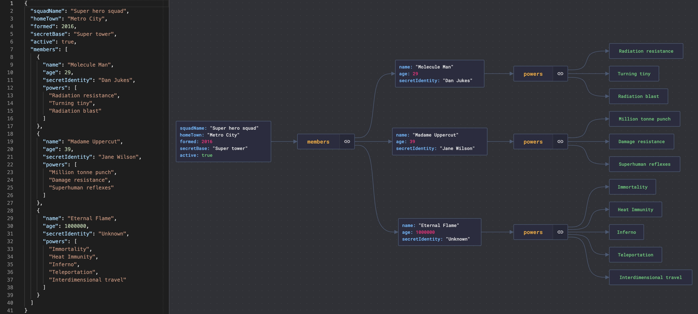
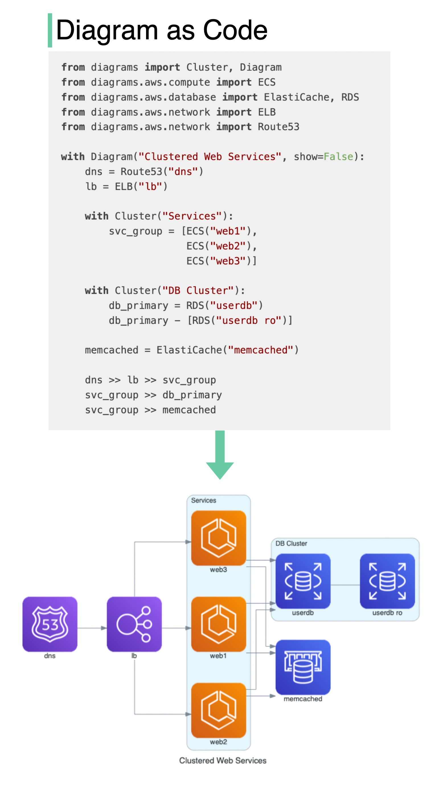

## 开发者生产力工具

### 可视化JSON文件

嵌套的JSON文件很难阅读。

**JsonCrack**从JSON文件生成图形图表，使其易于阅读。

此外，生成的图表可以下载为图像。

  

### 自动将代码转换为架构图

  

它能做什么？

- 用Python代码绘制云系统架构。
- 图表也可以在Jupyter笔记本中直接呈现。
- 不需要设计工具。
- 支持以下提供商：AWS、Azure、GCP、Kubernetes、阿里云、Oracle Cloud等。

[Github repo](https://github.com/mingrammer/diagrams)