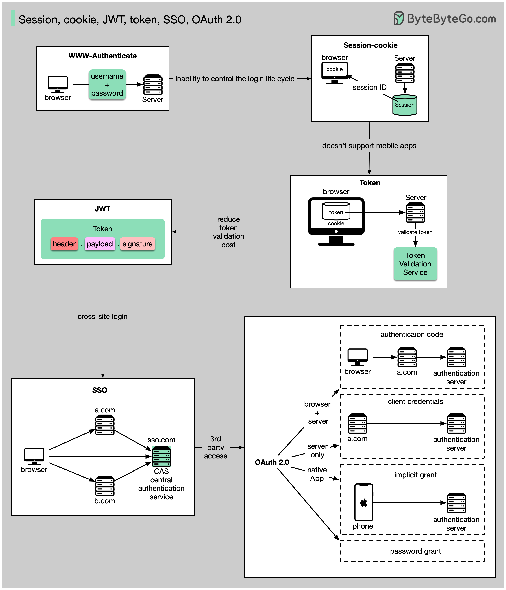
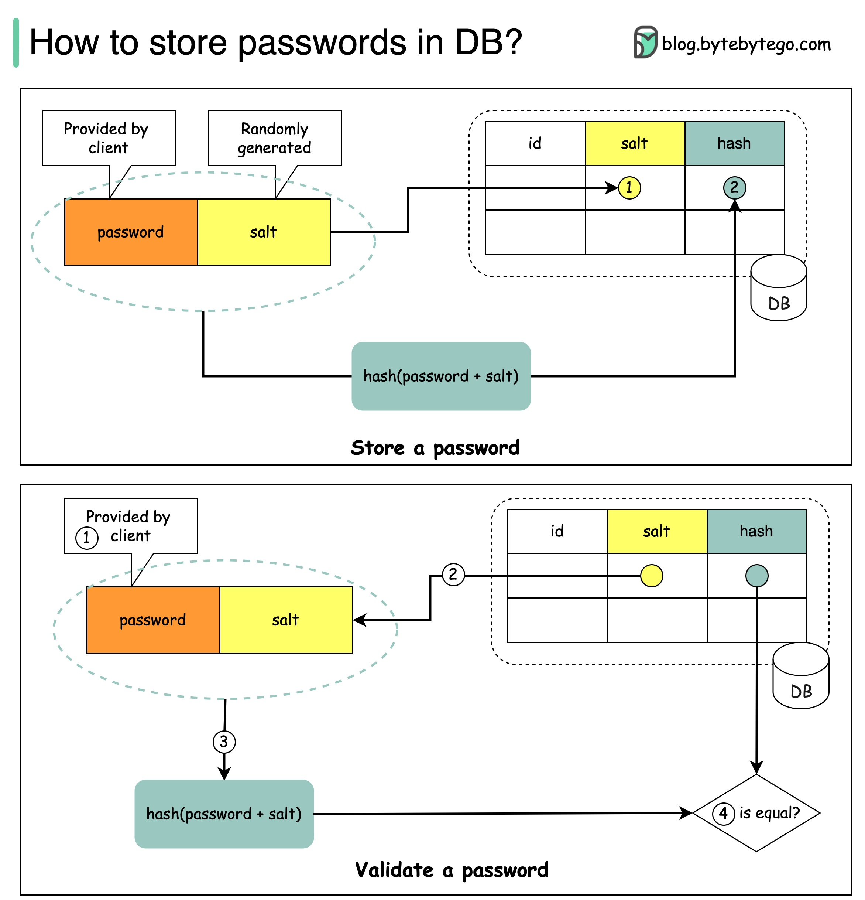
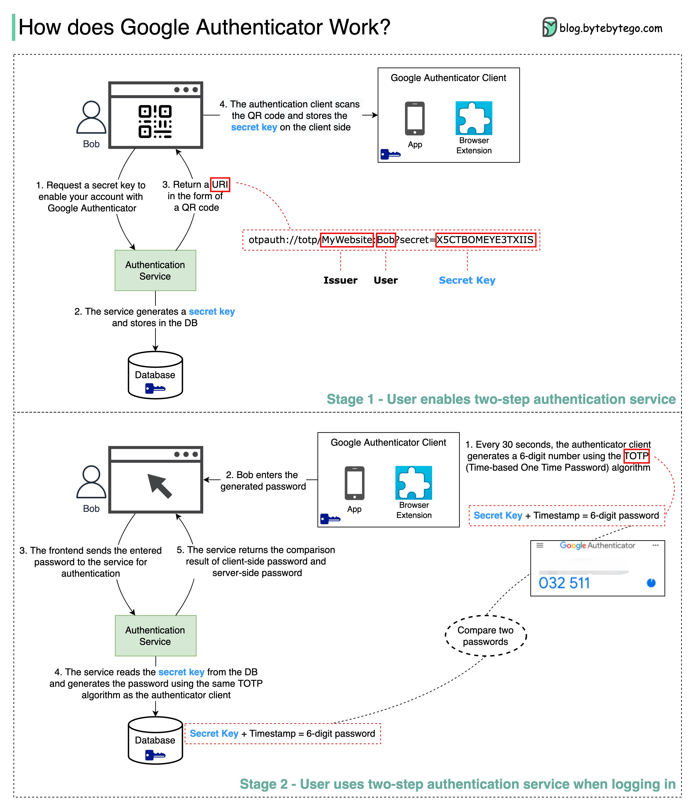

## 安全性

### https是如何工作的

超文本传输安全协议（HTTPS）是超文本传输协议（HTTP）的扩展。HTTPS使用传输层安全协议（TLS）传输加密数据。如果数据在在线上被劫持，劫持者只能获得二进制代码。

  

数据是如何加密和解密的？

步骤1 - 客户端（浏览器）和服务器建立TCP连接。

步骤2 - 客户端向服务器发送“客户端hello”消息。该消息包含一组必要的加密算法（密码套件）和它支持的最新TLS版本。服务器响应一个“服务器hello”，以使浏览器知道它是否支持这些算法和TLS版本。

然后，服务器向客户端发送SSL证书。该证书包含公钥、主机名、过期日期等。客户端验证证书。

步骤3 - 在验证SSL证书后，客户端生成一个会话密钥，并使用公钥对其进行加密。服务器接收加密的会话密钥，并使用私钥对其进行解密。

步骤4 - 现在，客户端和服务器都持有相同的会话密钥（对称加密），加密数据在一个安全的双向通道中传输。

为什么HTTPS在数据传输期间要切换到对称加密？有两个主要原因：

1. 安全性：非对称加密只能单向进行。这意味着如果服务器试图将加密数据发送回客户端，任何人都可以使用公钥解密数据。
2. 服务器资源：非对称加密增加了相当多的数学开销。它不适用于长时间会话中的数据传输。

### 用简单的术语解释oauth2

OAuth 2.0 是一个强大且安全的框架，可以让不同的应用程序代表用户在不共享敏感凭证的情况下安全地互相交互。

  

OAuth 涉及的实体有用户、服务器和身份提供者（IDP）。

OAuth Token 可以做什么？

当您使用 OAuth 时，您会获得一个代表您身份和权限的 OAuth Token。该 Token 可以做一些重要的事情：

单点登录（SSO）：使用 OAuth Token，您可以只使用一个登录即可登录多个服务或应用程序，让您的生活更加轻松和安全。

系统间授权：OAuth Token 允许您在各个系统之间共享您的授权或访问权限，因此您不必在各处单独登录。

访问用户资料：具有 OAuth Token 的应用程序可以访问您允许的某些用户资料的部分内容，但不会查看全部。

请记住，OAuth 2.0 的目的是在不同的应用程序和服务之间使您的在线体验无缝、无忧，并保护您和您的数据的安全。

### 认证机制的四种主要形式

  

* SSH Keys:

SSH 密钥：用于安全地访问远程系统和服务器的加密密钥

* OAuth Tokens:

OAuth Token：提供对第三方应用程序上用户数据的有限访问权限的令牌

* SSL Certificates:

SSL 证书：数字证书确保服务器和客户端之间的通信安全和加密

* Credentials:

凭证：用户身份验证信息用于验证并授予对各种系统和服务的访问权限

### session-cookie-jwt-token-sso-and-oauth-20---它们是什么？

这些术语都与用户身份管理相关。当您登录网站时，您声明了自己的身份（识别）。您的身份将得到验证（认证），并被授予必要的权限（授权）。过去提出了许多解决方案，这个列表还在不断增长

  

从简单到复杂，这是我对用户身份管理的理解：

- WWW-Authenticate是最基本的方法。浏览器会要求您输入用户名和密码。由于无法控制登录生命周期，它现在很少使用。
- Session-Cookie可以更细致地控制登录生命周期。服务器维护会话存储，浏览器保留会话ID。Cookie通常只适用于浏览器，不适用于移动应用程序。
- 为了解决兼容性问题，可以使用Token。客户端将Token发送到服务器，服务器验证Token。缺点是Token需要加密和解密，可能会耗费时间。
- JWT是表示Token的标准方式。这些信息可以得到验证和信任，因为它们是数字签名的。由于JWT包含签名，因此不需要在服务器端保存会话信息。
- 通过使用SSO（单点登录），您只需登录一次即可登录多个网站。它使用CAS（中央认证服务）来维护跨站点信息。
- 通过使用OAuth 2.0，您可以授权一个网站访问另一个网站上的您的信息。

### 如何安全地在数据库中存储密码以及如何验证密码？

  

**不应该做的事情**

- 存储明文密码不是一个好主意，因为任何有内部访问权限的人都可以看到它们。
- 直接存储密码哈希不足够安全，因为它容易受到预计算攻击，如彩虹表攻击。
- 为了减轻预计算攻击，我们对密码进行加盐处理。

**什么是盐？**

根据OWASP指南，“盐是在哈希过程中作为唯一随机生成的字符串添加到每个密码中的一部分”。

**如何存储密码和盐？**

1. 哈希结果对于每个密码都是唯一的。
2. 可以使用以下格式将密码存储在数据库中：hash(password + salt)。

**如何验证密码？**

要验证密码，可以进行以下过程：

1. 客户端输入密码。
2. 系统从数据库中获取相应的盐。
3. 系统将盐附加到密码上并进行哈希处理。我们称哈希值为H1。
4. 系统比较H1和H2，其中H2是存储在数据库中的哈希值。如果它们相同，则密码有效。

### 用通俗易懂的语言解释json-web-token-jwt

  

想象一下，你有一个特殊的盒子，叫做JWT。在这个盒子里，有三个部分：头部、载荷和签名。

头部就像盒子外面的标签。它告诉我们盒子的类型和如何保证安全。它通常采用JSON格式编写，JSON是一种使用花括号{ }和冒号:来组织信息的方式。

载荷就像你想要发送的实际信息或数据。它可以是你的姓名、年龄或任何你想要分享的数据。它也以JSON格式编写，因此易于理解和处理。

现在，签名是使JWT安全的关键。它就像一个特殊的印章，只有发送者知道如何创建。签名是使用秘密代码创建的，有点像密码。这个签名确保没有人可以在发送者不知道的情况下篡改JWT的内容。

当你想要将JWT发送到服务器时，你将头部、载荷和签名放在盒子里。然后你将它发送到服务器。服务器可以轻松地读取头部和载荷，以了解你是谁以及你想要做什么。en you want to send the JWT to a server, you put the header, payload, and signature inside the box. Then you send it over to the server. The server can easily read the header and payload to understand who you are and what you want to do.

### google-authenticator或其他类型的两步验证器是如何工作的？

Google Authenticator通常用于启用2因素身份验证时登录我们的帐户。它如何保证安全？

Google Authenticator是一种基于软件的验证器，实现了两步验证服务。以下图表提供了详细信息。

  

这里涉及到两个阶段：

- 阶段1 - 用户启用谷歌两步验证。
- 阶段2 - 用户使用验证器进行登录等操作。

让我们来看看这些阶段。

**阶段1**

步骤1和2：Bob打开网页启用两步验证。前端请求一个秘密密钥。认证服务为Bob生成秘密密钥并将其存储在数据库中。

步骤3：认证服务向前端返回一个URI。URI由密钥发行者、用户名和秘密密钥组成。URI以QR码的形式显示在网页上。

步骤4：然后Bob使用Google Authenticator扫描生成的QR码。秘密密钥存储在验证器中。

**阶段2**
步骤1和2：Bob想要使用谷歌两步验证登录网站。为此，他需要密码。每30秒，Google Authenticator使用TOTP（基于时间的一次性密码）算法生成一个6位数字密码。Bob使用密码进入网站。

步骤3和4：前端将Bob输入的密码发送到后端进行身份验证。认证服务从数据库中读取秘密密钥，并使用与客户端相同的TOTP算法生成一个6位数字密码。

步骤5：认证服务比较客户端和服务器生成的两个密码，并将比较结果返回给前端。只有两个密码匹配时，Bob才能继续登录过程。

这种身份验证机制安全吗？

- 其他人能否获取秘密密钥？

  我们需要确保使用HTTPS传输秘密密钥。验证器客户端和数据库存储秘密密钥，我们需要确保秘密密钥已加密。

- 黑客能否猜测6位数字密码？

  不行。密码有6位数字，因此生成的密码有100万个潜在组合。此外，密码每30秒变一次。如果黑客想在30秒内猜测密码，他们需要每秒输入30,000个组合。