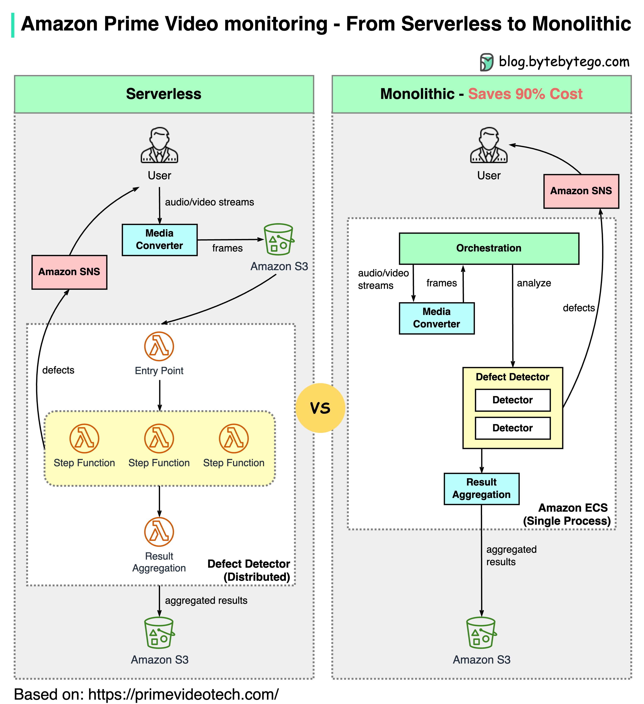
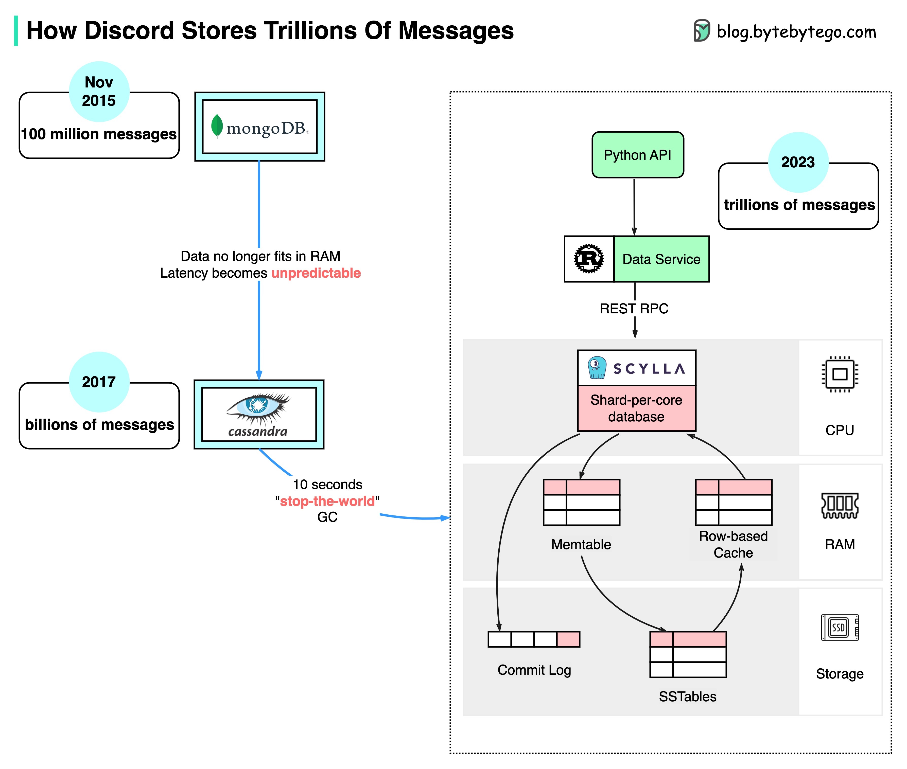

##  真实案例研究

### netflix的技术栈

本篇文章基于Netflix工程博客和开源项目的研究。如果您发现任何不准确的地方，请随时告诉我们。

  

**移动端和Web端**：Netflix采用Swift和Kotlin构建本地移动应用程序。对于Web应用程序，它使用React。

**前端/服务器通信**：Netflix使用GraphQL。

**后端服务**：Netflix依赖于ZUUL、Eureka、Spring Boot框架和其他技术。

**数据库**：Netflix利用EV Cache、Cassandra、CockroachDB和其他数据库。

**消息/流处理**：Netflix使用Apache Kafka和Fink进行消息和流处理。

**视频存储**：Netflix使用S3和Open Connect进行视频存储。

**数据处理**：Netflix利用Flink和Spark进行数据处理，然后使用Tableau进行可视化。Redshift用于处理结构化数据仓库信息。

**CI/CD**：Netflix采用各种工具，如JIRA、Confluence、PagerDuty、Jenkins、Gradle、Chaos Monkey、Spinnaker、Atlas等进行CI/CD流程。

### twitter 2022年的架构

Yes, this is the real Twitter architecture. It is posted by Elon Musk and redrawn by us for better readability.

  

### airbnb过去15年中微服务架构的演变

Airbnb’s microservice architecture went through 3 main stages.

Airbnb的微服务架构经历了三个主要阶段。

  

单体架构（2008-2017）

Airbnb最初只是一个简单的房东和客人市场。这是在Ruby on Rails应用程序中构建的 - 单体架构。

面临的挑战是什么？

- 团队所有权混淆+未拥有的代码
- 部署缓慢

微服务（2017-2020）

微服务旨在解决这些挑战。在微服务架构中，关键服务包括：

- 数据获取服务
- 业务逻辑数据服务
- 写工作流服务
- UI聚合服务
- 每个服务都有一个拥有团队

面临的挑战是什么？

数百个服务和依赖项对人类来说很难管理。

微服务+宏服务（2020-现在）

这是Airbnb目前正在研究的。微服务和宏服务混合模型的重点是API的统一。

### Monorepo vs. Microrepo.

> Monorepo和Microrepo是两种不同的代码库管理方法。

哪个是最好的？为什么不同的公司选择不同的选项？

  

Monorepo并不是新的概念，Linux和Windows都是使用Monorepo创建的。为了提高可扩展性和构建速度，谷歌开发了内部专用工具链以更快地扩展，同时采用了严格的编码质量标准来保持一致性。

亚马逊和Netflix是微服务哲学的主要代表。这种方法自然地将服务代码分成不同的存储库。它可以更快地扩展，但后期可能会出现治理痛点。

在Monorepo中，每个服务都是一个文件夹，每个文件夹都有BUILD配置和OWNERS权限控制。每个服务成员都负责自己的文件夹。

另一方面，在Microrepo中，每个服务都负责自己的存储库，构建配置和权限通常设置为整个存储库。

在Monorepo中，无论您的业务如何，依赖关系都是在整个代码库中共享的，因此，当有版本升级时，每个代码库都会升级其版本。

在Microrepo中，依赖关系是在每个存储库中控制的。业务可以根据自己的时间表选择何时升级版本。

Monorepo有一个标准的签入流程。谷歌的代码审查流程因设定了高标准而闻名，确保了Monorepo的一致质量标准，无论业务如何。

Microrepo可以自己设置标准，也可以采用最佳实践并采用共享标准。它可以更快地为业务扩展，但代码质量可能会有所不同。

谷歌工程师构建了Bazel，Meta构建了Buck。还有其他开源工具可用，包括Nix、Lerna和其他工具。

多年来，Microrepo支持的工具越来越多，包括Java的Maven和Gradle、NodeJS的NPM以及C/C++的CMake等。

### 你会如何设计stack overflow网站

如果你的答案是基于现场服务器和单体架构（在下面的图像中），你可能会在面试中失败，但这就是实际构建的方式！

  

**人们认为它应该是什么样子**

面试官可能期望的是上图的顶部部分。

- 微服务用于将系统分解为小组件。
- 每个服务都有自己的数据库。大量使用缓存。
- 服务被分片。
- 服务通过消息队列异步交互。
- 服务使用事件溯源和CQRS实现。
- 展示分布式系统方面的知识，例如最终一致性、CAP定理等。

**实际情况**

Stack Overflow仅使用9个现场Web服务器处理所有流量，而且它是一个单体架构！它有自己的服务器，不运行在云上。

这与我们当今的所有流行信仰相反。

### 为什么Amazon Prime Video的监控从无服务器转向单体应用? 如何节省90的成本?

下面的图表显示了迁移前后的架构比较。

  

亚马逊Prime Video监控服务是什么？

Prime Video服务需要监控数千个实时流的质量。监控工具自动分析实时流并识别质量问题，如块损坏、视频冻结和同步问题。这是客户满意度的重要流程。

有三个步骤：媒体转换器、缺陷检测器和实时通知。

- 旧架构存在什么问题？

旧架构基于Amazon Lambda构建，用于快速构建服务。然而，在高规模运行架构时，它并不具备成本效益。最昂贵的两个操作是：

1. 编排工作流程 - AWS步骤函数按状态转换收费，编排每秒执行多个状态转换。
2. 分布式组件之间的数据传递 - 中间数据存储在Amazon S3中，以便下一个阶段可以下载。当数据量很大时，下载可能很昂贵。

- 单体架构节省90%的成本

单体架构旨在解决成本问题。仍然有三个组件，但媒体转换器和缺陷检测器部署在同一进程中，节省了通过网络传递数据的成本。令人惊讶的是，这种部署架构变更方法导致了90%的成本节约！

这是一个有趣且独特的案例研究，因为微服务已成为技术行业的首选和时尚选择。很高兴看到我们正在更多地讨论如何发展架构，并更加诚实地讨论其优缺点。将组件分解为分布式微服务会带来成本。

- 亚马逊领袖对此有何看法？

亚马逊首席技术官Werner Vogels： "构建**可发展的软件系统**是一种策略，而不是一种宗教。以开放的心态重新审视您的架构是必须的。"

前亚马逊可持续性副总裁Adrian Cockcroft： "Prime Video团队已经遵循了我称之为**Serverless First**的路径...我不赞成**Serverless Only**。"

### disney hotstar如何在锦标赛期间捕捉50亿个表情符号

  

1. 客户端通过标准HTTP请求发送表情符号。您可以将Golang服务视为典型的Web服务器。选择Golang是因为它很好地支持并发。Golang中的线程是轻量级的。
2. 由于写入量非常高，使用Kafka（消息队列）作为缓冲区。
3. 表情符号数据由名为Spark的流处理服务聚合。它每2秒聚合一次数据，这是可配置的。根据间隔需要进行权衡。较短的间隔意味着表情符号将更快地传递给其他客户端，但这也意味着需要更多的计算资源。
4. 聚合数据被写入另一个Kafka。
5. PubSub消费者从Kafka中拉取聚合的表情符号数据。
6. 表情符号通过PubSub基础架构实时传递给其他客户端。PubSub基础架构很有趣。Hotstar考虑了以下协议：Socketio、NATS、MQTT和gRPC，并选择了MQTT。

LinkedIn采用了类似的设计，可以每秒流式传输一百万个赞。

### discord如何存储数万亿条消息

The diagram below shows the evolution of message storage at Discord:

下面的图表显示了Discord消息存储的演变过程：

  

MongoDB ➡️ Cassandra ➡️ ScyllaDB

2015年，Discord的第一个版本建立在单个MongoDB副本之上。到了2015年11月，MongoDB存储了1亿条消息，内存无法再容纳数据和索引。延迟变得不可预测，消息存储需要迁移到另一个数据库。他们选择了Cassandra。

到了2017年，Discord有12个Cassandra节点，存储着数十亿条消息。

在2022年初，它拥有了177个节点，存储着数万亿条消息。此时，延迟变得不可预测，维护操作的成本也变得太高。

这个问题有几个原因：

Cassandra使用LSM树作为内部数据结构。读取比写入更昂贵。在有数百个用户的服务器上可能会有许多并发读取，导致热点问题。
维护群集，如压缩SSTables，会影响性能。
垃圾回收暂停会导致显著的延迟峰值。
ScyllaDB是一个用C++编写的与Cassandra兼容的数据库。Discord重新设计了其架构，拥有一个单体式API，一个用Rust编写的数据服务和基于ScyllaDB的存储。

在ScyllaDB中，p99读取延迟为15毫秒，而在Cassandra中为40-125毫秒。p99写入延迟为5毫秒，而在Cassandra中为5-70毫秒。.

### youtube tiktok live或twitch上的视频直播是如何工作的

直播流与常规流媒体不同，因为视频内容是通过互联网实时发送的，通常延迟只有几秒钟。

下面的图示解释了实现这一点的背后发生的事情。

  

第一步：原始视频数据由麦克风和摄像头捕捉。数据被发送到服务器端。

第二步：视频数据被压缩和编码。例如，压缩算法将背景和其他视频元素分离。压缩后，视频被编码为标准格式，例如H.264。经过这一步骤后，视频数据的大小大大缩小。

第三步：编码数据被分成更小的片段，通常是几秒钟的长度，以便下载或流媒体所需的时间更短。

第四步：分段数据被发送到流媒体服务器。流媒体服务器需要支持不同的设备和网络条件。这被称为“自适应比特率流媒体”。这意味着我们需要在步骤2和3中生成多个不同比特率的文件。

第五步：直播流数据被推送到由CDN（内容分发网络）支持的边缘服务器。数百万观众可以从附近的边缘服务器观看视频。CDN显着降低了数据传输延迟。

第六步：观众设备解码和解压缩视频数据，并在视频播放器中播放视频。

第七步和第八步：如果需要将视频存储以供重播，编码数据将被发送到存储服务器，观众稍后可以从中请求重播。

直播流的标准协议包括：

- RTMP（实时消息传输协议）：最初由Macromedia开发，用于在Flash播放器和服务器之间传输数据。现在它用于在互联网上流传视频数据。请注意，像Skype这样的视频会议应用程序使用RTC（实时通信）协议以实现更低的延迟。
- HLS（HTTP Live Streaming）：需要H.264或H.265编码。Apple设备只支持HLS格式。
- DASH（动态自适应流媒体）：DASH不支持Apple设备。
- HLS和DASH都支持自适应比特率流媒体。