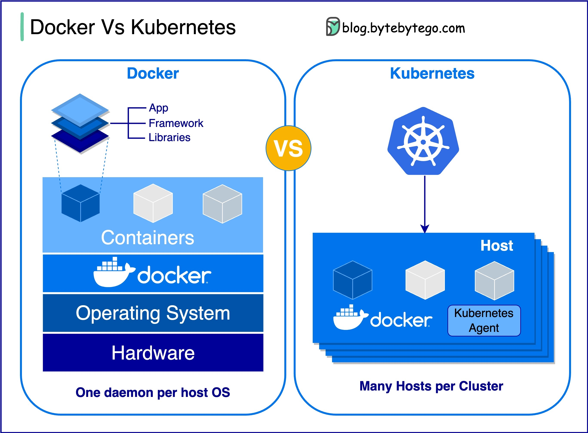

## DevOps

###  DevOps与SRE与平台工程的区别是什么？

DevOps、SRE和平台工程的概念是在不同的时间出现的，并由各个个人和组织进行了发展。

  

DevOps作为一个概念于2009年由Patrick Debois和Andrew Shafer在敏捷大会上提出。他们试图通过促进协作文化和共同负责整个软件开发生命周期来弥合软件开发和运营之间的差距。

SRE或站点可靠性工程是由Google在2000年代初引入的，旨在解决管理大规模复杂系统的运营挑战。Google开发了SRE实践和工具，例如Borg集群管理系统和Monarch监控系统，以提高其服务的可靠性和效率。

平台工程是一个更为新近的概念，建立在SRE工程的基础之上。平台工程的确切起源不太清楚，但它通常被理解为DevOps和SRE实践的扩展，重点是提供一个全面支持整个业务视角的产品开发平台。

值得注意的是，尽管这些概念在不同的时间出现，但它们都与改进软件开发和运营中的协作、自动化和效率的广泛趋势相关。

### 什么是k8s

K8s是一个容器编排系统，用于容器的部署和管理。它的设计受到了Google内部系统Borg的影响。

  

一个k8s集群由一组运行容器化应用程序的工作节点（称为节点）组成。每个集群至少有一个工作节点。

工作节点托管Pod，这些Pod是应用程序工作负载的组成部分。控制平面管理集群中的工作节点和Pod。在生产环境中，控制平面通常跨多台计算机运行，集群通常运行多个节点，提供容错和高可用性。

控制平面组件
API服务器

API服务器与k8s集群中的所有组件进行通信。所有pod的操作都通过与API服务器通信执行。

调度器

调度器观察Pod的工作负载，并将负载分配给新创建的Pod。

控制器管理器

控制器管理器运行控制器，包括Node Controller，Job Controller，EndpointSlice Controller和ServiceAccount Controller等。

Etcd

etcd是一个键值存储，用作Kubernetes的后备存储器，用于存储所有集群数据。

节点
Pod

Pod是一组容器，是k8s管理的最小单位。Pod具有应用于Pod中每个容器的单个IP地址。

Kubelet

在集群中的每个节点上运行的代理。它确保容器在Pod中运行。

Kube Proxy

Kube-proxy是一个网络代理，运行在集群中的每个节点上。它将从服务进入节点的流量路由到正确的容器。它将请求转发到正确的容器，以便执行工作。

### Docker与Kubernetes。我们应该使用哪个？

  

什么是Docker？

Docker是一个开源平台，允许您在隔离的容器中打包、分发和运行应用程序。它专注于容器化，提供轻量级环境，封装应用程序及其依赖项。

什么是Kubernetes？

Kubernetes，通常称为K8s，是一个开源容器编排平台。它提供了一个框架，用于自动化部署、扩展和管理容器化应用程序跨节点的集群。

它们之间有什么不同？

Docker：Docker在单个操作系统主机上的单个容器级别操作。

您必须手动管理每个主机，为多个相关容器设置网络、安全策略和存储可能会很复杂。

Kubernetes：Kubernetes在集群级别上运行。它管理多个容器化应用程序跨多个主机，提供自动化的任务，如负载平衡、扩展和确保应用程序的期望状态。

简而言之，Docker专注于容器化和在单个主机上运行容器，而Kubernetes专门管理和编排容器在跨多个主机的集群中运行。

### Docker是如何工作的

下面的图表显示了Docker的架构以及当我们运行 “docker build”、“docker pull” 和 “docker run” 时它是如何工作的。

  

Docker架构有三个组件：

- Docker客户端

  Docker客户端与Docker守护进程通信。

- Docker宿主机

  Docker守护进程监听Docker API请求，并管理Docker对象，如镜像、容器、网络和卷。

- Docker注册表

  Docker注册表存储Docker镜像。Docker Hub是一个公共注册表，任何人都可以使用。

让我们以“docker run”命令为例。

1. Docker从注册表中拉取镜像。
2. Docker创建一个新的容器。
3. Docker为容器分配一个读写文件系统。
4. Docker创建一个网络接口，将容器连接到默认网络。
5. Docker启动容器。