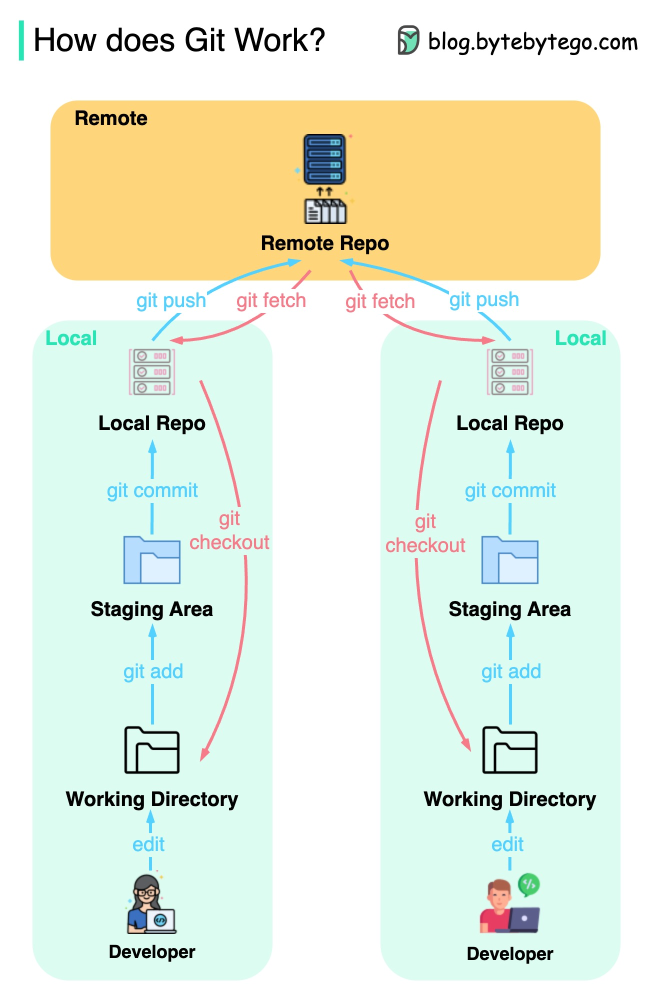

## GIT

### git命令的工作原理

首先，必须确定我们的代码存储在哪里。通常认为只有两个位置 - 一个是在像Github这样的远程服务器上，另一个是在我们的本地计算机上。然而，这并不完全准确。Git在我们的计算机上维护了三个本地存储，这意味着我们的代码可以在四个位置找到：

  

* 工作目录：我们编辑文件的地方。
* 暂存区：一个临时位置，文件被保存在这里以供下一次提交使用。
* 本地仓库：包含已提交的代码。
* 远程仓库：存储代码的远程服务器。

大多数Git命令主要在这四个位置之间移动文件。

### git是如何工作的

The diagram below shows the Git workflow.

  

Git是一种分布式版本控制系统。

每个开发者都维护着主仓库的本地副本，并对其进行编辑和提交。

由于操作不涉及远程仓库，因此提交非常快速。

如果远程仓库崩溃，可以从本地仓库恢复文件。

### git合并与git变基

What are the differences?

当我们将一个Git分支的更改合并到另一个分支时，可以使用“git merge”或“git rebase”。下面的图表展示了这两个命令的工作方式。

  

**Git合并**

这将在主分支中创建一个新的提交G'。G'将主分支和功能分支的历史记录联系起来。

Git合并是**非破坏性的**。主分支和功能分支都不会被更改。

**Git变基**

Git变基将功能分支的历史记录移动到主分支的头部。它为功能分支中的每个提交创建新的提交E'、F'和G'。

使用变基的好处是它具有线性的**提交历史记录**。

如果不遵循“Git变基的黄金法则”，它可能会带来风险。

**Git变基的黄金法则**

永远不要在公共分支上使用它！