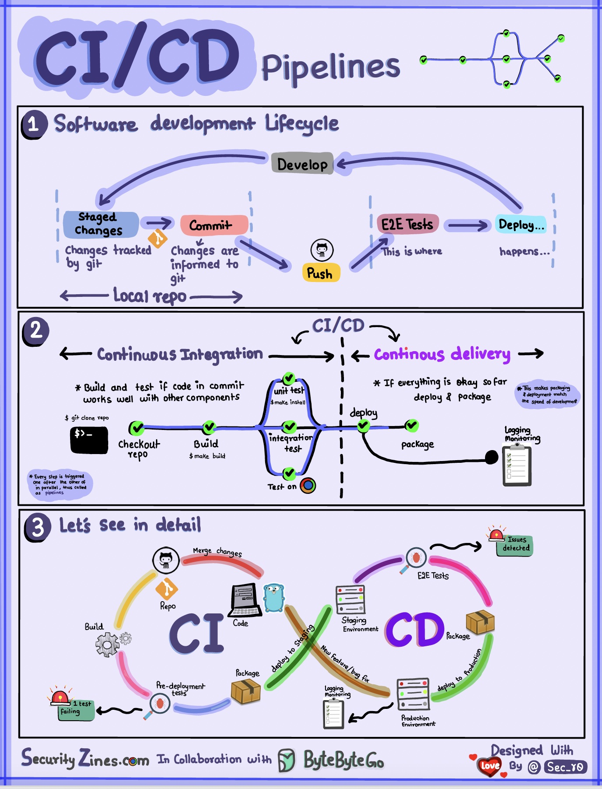

 
- [CI/CD](#CI/CD)
    - [简单介绍CI/CD流程](#简单介绍CI/CD流程)
    - [Netflix技术栈（CI/CD流程）](#Netflix技术栈(CI/CD流程))

## CI/CD

### 简单介绍CI/CD流程 {#简单介绍CI/CD流程}

  

Section 1 - SDLC with CI/CD

The software development life cycle (SDLC) consists of several key stages: development, testing, deployment, and maintenance. CI/CD automates and integrates these stages to enable faster and more reliable releases.

When code is pushed to a git repository, it triggers an automated build and test process. End-to-end (e2e) test cases are run to validate the code. If tests pass, the code can be automatically deployed to staging/production. If issues are found, the code is sent back to development for bug fixing. This automation provides fast feedback to developers and reduces the risk of bugs in production.

Section 2 - Difference between CI and CD

Continuous Integration (CI) automates the build, test, and merge process. It runs tests whenever code is committed to detect integration issues early. This encourages frequent code commits and rapid feedback.

Continuous Delivery (CD) automates release processes like infrastructure changes and deployment. It ensures software can be released reliably at any time through automated workflows. CD may also automate the manual testing and approval steps required before production deployment.

Section 3 - CI/CD Pipeline

A typical CI/CD pipeline has several connected stages:
- The developer commits code changes to the source control
- CI server detects changes and triggers the build
- Code is compiled, and tested (unit, integration tests)
- Test results reported to the developer
- On success, artifacts are deployed to staging environments
- Further testing may be done on staging before release
- CD system deploys approved changes to production

### Netflix技术栈(CI/CD流程)

  

Planning: Netflix Engineering uses JIRA for planning and Confluence for documentation.

Coding: Java is the primary programming language for the backend service, while other languages are used for different use cases.

Build: Gradle is mainly used for building, and Gradle plugins are built to support various use cases.

Packaging: Package and dependencies are packed into an Amazon Machine Image (AMI) for release.

Testing: Testing emphasizes the production culture's focus on building chaos tools.

Deployment: Netflix uses its self-built Spinnaker for canary rollout deployment.

Monitoring: The monitoring metrics are centralized in Atlas, and Kayenta is used to detect anomalies.

Incident report: Incidents are dispatched according to priority, and PagerDuty is used for incident handling. 
