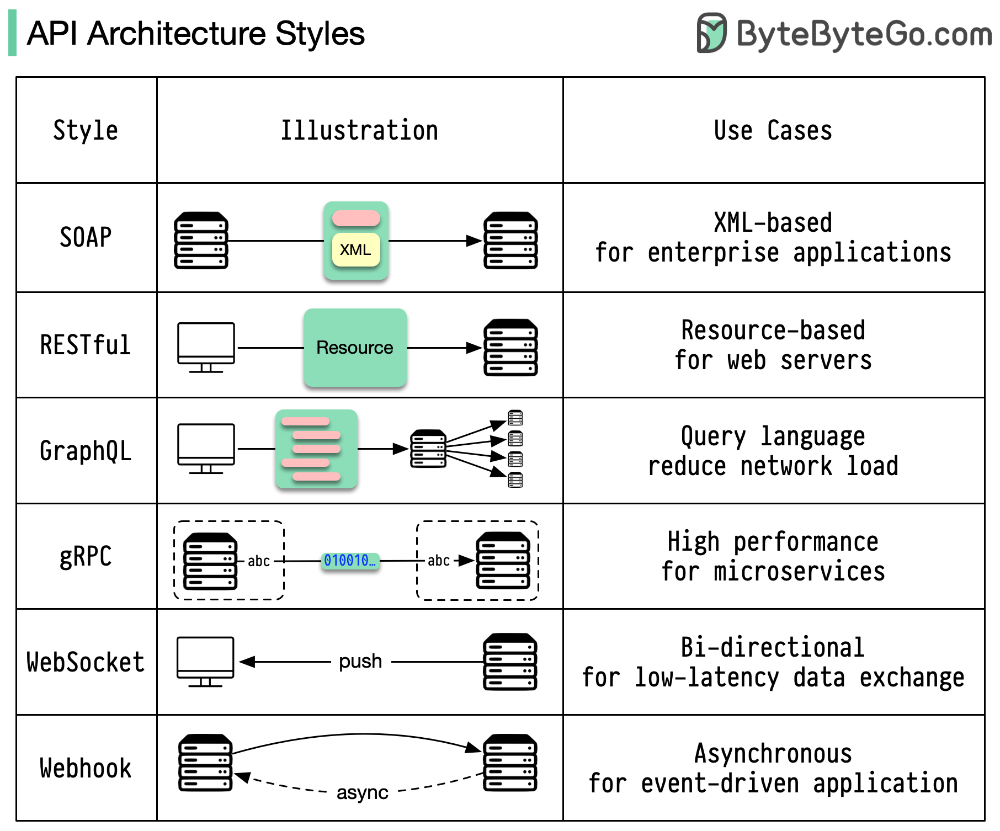
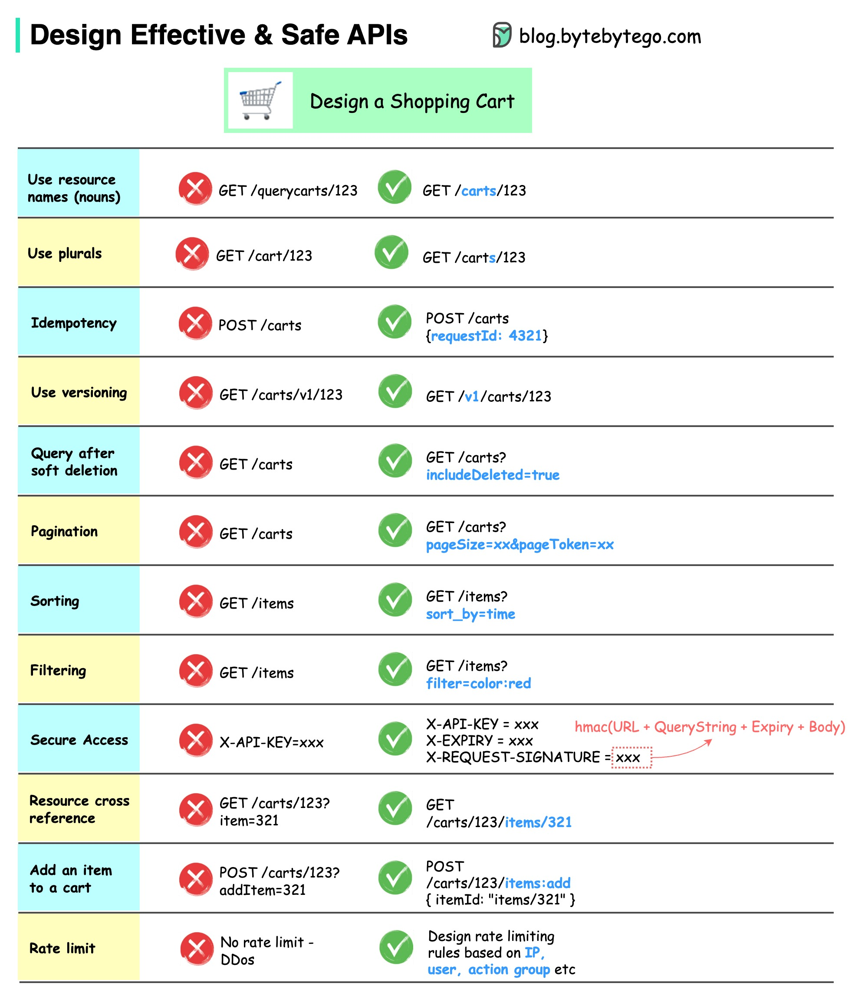

- [通信协议](#communication-protocols)
    - [REST API vs. GraphQL](#rest-api-vs-graphql)
    - [gRPC 是如何工作的？](#how-does-grpc-work)
    - [什么是 Webhook？](#what-is-a-webhook)
    - [如何提高 API 性能？](#how-to-improve-api-performance)
    - [HTTP 1.0 -> HTTP 1.1 -> HTTP 2.0 -> HTTP 3.0 (QUIC)](#http-10---http-11---http-20---http-30-quic)
    - [SOAP vs REST vs GraphQL vs RPC](#soap-vs-rest-vs-graphql-vs-rpc)
    - [代码优先 vs. API 优先](#code-first-vs-api-first)
    - [HTTP 状态码](#http-status-codes)
    - [API 网关是什么？](#API-网关是什么)
    - [如何设计有效和安全的 API？](#how-do-we-design-effective-and-safe-apis)
    - [TCP/IP 封装](#tcpip-encapsulation)
    - [为什么 Nginx 被称为“反向”代理？](#why-is-nginx-called-a-reverse-proxy)
    - [常见的负载均衡算法有哪些？](#what-are-the-common-load-balancing-algorithms)
    - [URL、URI、URN - 你知道它们的区别吗？](#url-uri-urn---do-you-know-the-differences)

## Communication protocols

架构风格定义了应用程序编程接口（API）的不同组件之间的相互交互方式。因此，它们通过提供一种标准的设计和构建API的方法，确保了效率、可靠性和与其他系统的轻松集成。以下是最常用的几种风格：

  

- SOAP（简单对象访问协议）：成熟、全面、基于XML的协议。适用于企业应用程序。

- RESTful（表现层状态转移）：流行、易于实现、基于HTTP方法的协议。适用于Web服务。

- GraphQL：一种查询语言，用于请求特定的数据。减少网络开销，提供更快的响应。

- gRPC：现代化、高性能、使用Protocol Buffers（协议缓冲区）的协议。适用于微服务架构。

- WebSocket：实时、双向、持久连接的协议。非常适合低延迟的数据交换。

- Webhook：事件驱动、使用HTTP回调、异步的协议。在事件发生时通知系统。

### REST API vs. GraphQL

在API设计方面，REST和GraphQL各有其优势和劣势。

下面的图表展示了REST和GraphQL之间的快速比较

  

REST：

- 使用标准的HTTP方法（如GET、POST、PUT、DELETE）进行CRUD操作。
- 在需要在独立服务/应用之间使用简单、统一的接口时表现良好。
- 缓存策略易于实现。
- 不足之处在于可能需要多次往返请求来组装来自不同端点的相关数据。

GraphQL：

- 为客户端提供单一的端点，以准确获取所需的数据。
- 客户端可以指定嵌套查询中需要的确切字段，服务器返回仅包含这些字段的优化负载。
- 支持用于修改数据的Mutations和用于实时通知的Subscriptions。
- 适用于从多个来源聚合数据，并且与快速变化的前端需求配合良好。
- 然而，它将复杂性转移到客户端，如果没有适当的保护措施，可能会允许滥用查询。
- 缓存策略可能比REST更复杂。

在REST和GraphQL之间选择最佳方案取决于应用程序和开发团队的具体要求。对于复杂或经常变化的前端需求，GraphQL是一个很好的选择，而对于偏好简单和一致性契约的应用程序，REST更合适。

两种API方法都没有银弹。仔细评估需求和权衡是选择正确风格的重要因素。REST和GraphQL都是公认的在暴露数据和支持现代应用程序方面的有效选择。

### How does gRPC work?

RPC（Remote Procedure Call）之所以被称为“远程”，是因为它在微服务架构下，当服务部署在不同的服务器上时，可以实现远程服务之间的通信。从用户的角度来看，它就像是本地函数调用一样。

下面的图表说明了gRPC的总体数据流程。

  

步骤1：客户端发起REST调用，请求体通常采用JSON格式。

步骤2-4：订单服务（gRPC客户端）接收到REST调用后，将其转换并发起RPC调用到支付服务。gRPC将客户端存根编码成二进制格式并发送给底层传输层。

步骤5：gRPC通过HTTP2将数据包发送到网络上。由于二进制编码和网络优化，gRPC被称为比JSON快5倍。

步骤6-8：支付服务（gRPC服务器）接收到网络上的数据包，解码并调用服务器应用程序。

步骤9-11：服务器应用程序返回结果，对其进行编码并发送到传输层。

步骤12-14：订单服务接收到数据包，进行解码并将结果发送给客户端应用程序。
### What is a webhook?

下面的图表展示了轮询和Webhook的比较。

  

假设我们运营一家电商网站。客户通过API网关将订单发送到订单服务，该服务将订单传递给支付服务进行支付交易。然后，支付服务与外部支付服务提供商（PSP）进行通信，以完成交易。

处理与外部PSP的通信有两种方法。

**1. 短轮询**

在向PSP发送支付请求后，支付服务会不断向PSP询问支付状态，经过多轮后，PSP最终返回状态。

短轮询有两个缺点：

- 不断轮询状态会占用支付服务的资源。
- 外部服务直接与支付服务通信，存在安全漏洞。

**2. Webhook**

我们可以在外部服务中注册Webhook。这意味着：当您有关于该请求的更新时，请在某个URL上回调我。当PSP完成处理后，它将调用HTTP请求以更新支付状态。

通过这种方式，编程范式发生了改变，支付服务不再需要浪费资源来轮询支付状态。

如果PSP从未回调怎么办？我们可以设置一个定期作业，每小时检查一次支付状态。

Webhook通常被称为反向API或推送API，因为服务器向客户端发送HTTP请求。在使用Webhook时，我们需要注意以下三点：

1. 我们需要为外部服务设计适当的API来调用。
2. 我们需要为安全原因在API网关中设置适当的规则。
3. 我们需要在外部服务中注册正确的URL。

### How to improve API performance?

下面的图表展示了提高API性能的5个常见技巧。

  

分页

当结果集较大时，分页是一种常见的优化方式。将结果流式返回给客户端，以提高服务的响应性。

异步日志记录

同步日志记录每次调用都要处理磁盘，可能会减慢系统速度。异步日志记录会先将日志发送到无锁缓冲区，然后立即返回。日志将定期刷新到磁盘上。这可以显著减少I/O开销。

缓存

我们可以将经常访问的数据缓存起来。客户端可以首先查询缓存，而不是直接访问数据库。如果缓存未命中，客户端可以从数据库中查询。像Redis这样的缓存将数据存储在内存中，因此数据访问速度比数据库快得多。

负载压缩

可以使用gzip等方式压缩请求和响应，以使传输的数据大小更小。这可以加快上传和下载速度。

连接池

在访问资源时，我们通常需要从数据库中加载数据。打开和关闭数据库连接会增加很大的开销。因此，我们应该通过一组打开的连接连接到数据库。连接池负责管理连接的生命周期。

### HTTP 1.0 -> HTTP 1.1 -> HTTP 2.0 -> HTTP 3.0 (QUIC)

每一代HTTP解决了哪些问题？

下面的图表说明了关键特性。

  

- HTTP 1.0在1996年完成并完整记录。每个针对同一服务器的请求都需要单独的TCP连接。

- HTTP 1.1于1997年发布。TCP连接可以保持打开以供重用（持久连接），但它不能解决HOL（head-of-line）阻塞问题。

  HOL阻塞-当浏览器中允许的并行请求数量用完时，后续请求需要等待前面的请求完成。

- HTTP 2.0于2015年发布。它通过请求多路复用解决了HOL问题，该技术在应用层消除了HOL阻塞，但在传输（TCP）层仍存在HOL问题。

  如您在图表中所看到的，HTTP 2.0引入了HTTP“流”的概念：一种抽象，允许在同一TCP连接上多路复用不同的HTTP交换。每个流不需要按顺序发送。

- HTTP 3.0的第一版草案于2020年发布。它是HTTP 2.0的拟议后继者。它使用QUIC而不是TCP作为底层传输协议，从而消除了传输层中的HOL阻塞。

QUIC基于UDP。它在传输层引入了流作为一等公民。QUIC流共享相同的QUIC连接，因此不需要创建新连接时进行额外的握手和慢启动，但是QUIC流是独立交付的，因此在大多数情况下影响一个流的数据包丢失不会影响其他流。

### SOAP vs REST vs GraphQL vs RPC

下面的图表说明了API时间线和API风格的比较。

随着时间的推移，不同的API架构风格被发布。每种风格都有其自己的标准化数据交换的模式。

您可以在图表中查看每种风格的用例。

  

### Code First vs. API First

下面的图表展示了代码优先开发和API优先开发之间的区别。为什么我们要考虑API优先设计呢？

  

- 微服务增加了系统的复杂性，我们需要将不同的服务分离出来，以便服务于系统的不同功能。虽然这种架构有利于解耦和职责分离，但我们需要处理服务之间的各种通信。

在编写代码之前，最好先仔细思考系统的复杂性，并精心定义服务的边界。
- 不同的功能团队需要使用相同的语言，专门的功能团队只负责自己的组件和服务。建议通过API设计使组织使用相同的语言。

我们可以模拟请求和响应来验证API设计，然后再编写代码。
- 提高软件质量和开发者生产力。由于我们在项目开始时已经解决了大部分不确定性，因此整个开发过程更加顺畅，软件质量也得到了极大的提高。

开发人员也对这个过程感到满意，因为他们可以专注于功能开发，而不必应对突然的变化。

在项目生命周期的后期出现意外的可能性降低了。

由于我们首先设计了API，因此可以在代码开发时设计测试。在某种程度上，当使用API优先开发时，我们也具有TDD（测试驱动设计）。

### HTTP status codes

  

HTTP的响应代码分为五个类别：

- 信息性响应（100-199）
- 成功响应（200-299）
- 重定向响应（300-399）
- 客户端错误  (400-499)
- 服务的错误 (500-599)

### API 网关是什么

The diagram below shows the details.

  

步骤1 - 客户端向API网关发送HTTP请求。

步骤2 - API网关解析和验证HTTP请求中的属性。

步骤3 - API网关执行允许列表/拒绝列表检查。

步骤4 - API网关与身份提供者进行身份验证和授权。

步骤5 - 请求被应用速率限制规则。如果超过限制，请求将被拒绝。

步骤6和7 - 现在，请求已经通过基本检查，API网关通过路径匹配找到相关的服务进行路由。

步骤8 - API网关将请求转换为适当的协议并将其发送到后端微服务。

步骤9-12：API网关可以适当地处理错误，并在错误需要更长时间恢复时处理故障（断路器）。它还可以利用ELK（弹性-Logstash-Kibana）堆栈进行日志记录和监控。我们有时会在API网关中缓存数据。
### How do we design effective and safe APIs?

The diagram below shows typical API designs with a shopping cart example.

  

请注意，API设计不仅仅是URL路径设计。大多数情况下，我们需要选择适当的资源名称、标识符和路径模式。同样重要的是，在API网关中设计适当的HTTP标头字段或设计有效的速率限制规则。

### TCP/IP encapsulation

数据是如何通过网络传输的？为什么OSI模型需要这么多层？

下面的图表展示了数据在网络传输过程中的封装和解封装过程。

  

第一步：当设备A通过HTTP协议向设备B发送数据时，首先在应用层添加HTTP头部。

第二步：然后在传输层将TCP或UDP头部添加到数据中，并封装为TCP段。头部包含源端口、目标端口和序列号。

第三步：接着在网络层将段封装为IP头部。IP头部包含源/目标IP地址。

第四步：在数据链路层为IP数据报添加MAC头部，包含源/目标MAC地址。

第五步：封装好的帧被发送到物理层，并以二进制位的形式在网络中传输。

第六至十步：当设备B从网络中接收到位流时，它执行解封装过程，这是封装过程的逆向处理。头部被逐层移除，最终设备B可以读取数据。

我们需要网络模型中的各层，因为每个层都专注于自己的职责。每个层都可以依赖头部进行处理指令，而不需要了解上一层数据的含义。

### Why is Nginx called a “reverse” proxy?  为什么Nginx被称为“反向代理”？

The diagram below shows the differences between a 𝐟𝐨𝐫𝐰𝐚𝐫𝐝 𝐩𝐫𝐨𝐱𝐲 and a 𝐫𝐞𝐯𝐞𝐫𝐬𝐞 𝐩𝐫𝐨𝐱𝐲.
下面的图表展示了正向代理和反向代理之间的区别。

  

正向代理是位于用户设备和互联网之间的服务器。

正向代理通常用于：

1. 保护客户端
2. 绕过浏览限制
3. 阻止访问某些内容

反向代理是一种服务器，它接收客户端的请求，将请求转发给Web服务器，并将结果返回给客户端，就好像代理服务器已经处理了请求一样。

反向代理适用于以下情况：

1. 保护服务器
2. 负载均衡
3. 缓存静态内容
4. 加密和解密SSL通信

### What are the common load-balancing algorithms? 常见的负载均衡算法有哪些？

The diagram below shows 6 common algorithms.

  

- 静态算法

1. 轮询（Round Robin）

   将客户端请求按顺序发送到不同的服务实例。这些服务通常需要是无状态的。

2. 粘性轮询（Sticky Round Robin）

   这是轮询算法的一种改进。如果Alice的第一个请求发送到服务A，则后续请求也会发送到服务A。

3. 加权轮询（Weighted Round Robin）

   管理员可以为每个服务指定权重。权重高的服务处理的请求比其他服务多。

4. 哈希（Hash）

   此算法对传入请求的IP或URL应用哈希函数。请求基于哈希函数的结果路由到相关实例。

- 动态算法

1. 最少连接数（Least Connections）

   将新请求发送到并发连接最少的服务实例。

2. 最短响应时间（Least Response Time）

   将新请求发送到响应时间最快的服务实例。

### URL, URI, URN - Do you know the differences?

The diagram below shows a comparison of URL, URI, and URN.
下面的图表展示了URL、URI和URN之间的比较。

  

- URI

URI代表统一资源标识符。它标识Web上的逻辑或物理资源。URL和URN是URI的子类型。URL定位资源，而URN命名资源。

URI由以下部分组成：
scheme:[//authority]path[?query][#fragment]

- URL

URL代表统一资源定位符，是HTTP的关键概念。它是Web上唯一资源的地址。它可以与其他协议一起使用，如FTP和JDBC。

- URN

URN代表统一资源名称。它使用urn方案。URN不能用于定位资源。图表中给出的简单示例由命名空间和命名空间特定字符串组成。

如果您想了解更多细节，请参阅 [W3C’s clarification](https://www.w3.org/TR/uri-clarification/)
