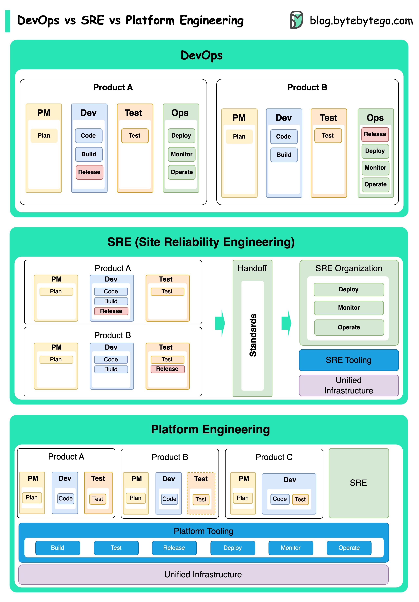

- [DevOps](#devops)
    - [DevOps vs. SRE vs. Platform Engineering. What is the difference?](#devops-vs-sre-vs-platform-engineering-what-is-the-difference)
    - [What is k8s (Kubernetes)?](#what-is-k8s-kubernetes)
    - [Docker vs. Kubernetes. Which one should we use?](#docker-vs-kubernetes-which-one-should-we-use)
    - [How does Docker work?](#how-does-docker-work)

## DevOps

###  DevOps vs. SRE vs. Platform Engineering. What is the difference?

The concepts of DevOps, SRE, and Platform Engineering have emerged at different times and have been developed by various individuals and organizations.

  

DevOps as a concept was introduced in 2009 by Patrick Debois and Andrew Shafer at the Agile conference. They sought to bridge the gap between software development and operations by promoting a collaborative culture and shared responsibility for the entire software development lifecycle.

SRE, or Site Reliability Engineering, was pioneered by Google in the early 2000s to address operational challenges in managing large-scale, complex systems. Google developed SRE practices and tools, such as the Borg cluster management system and the Monarch monitoring system, to improve the reliability and efficiency of their services.

Platform Engineering is a more recent concept, building on the foundation of SRE engineering. The precise origins of Platform Engineering are less clear, but it is generally understood to be an extension of the DevOps and SRE practices, with a focus on delivering a comprehensive platform for product development that supports the entire business perspective.

It's worth noting that while these concepts emerged at different times. They are all related to the broader trend of improving collaboration, automation, and efficiency in software development and operations.

### What is k8s (Kubernetes)?

K8s is a container orchestration system. It is used for container deployment and management. Its design is greatly impacted by Google’s internal system Borg.

  

A k8s cluster consists of a set of worker machines, called nodes, that run containerized applications. Every cluster has at least one worker node.

The worker node(s) host the Pods that are the components of the application workload. The control plane manages the worker nodes and the Pods in the cluster. In production environments, the control plane usually runs across multiple computers, and a cluster usually runs multiple nodes, providing fault tolerance and high availability.

- Control Plane Components

1. API Server

   The API server talks to all the components in the k8s cluster. All the operations on pods are executed by talking to the API server.

2. Scheduler

   The scheduler watches pod workloads and assigns loads on newly created pods.

3. Controller Manager

   The controller manager runs the controllers, including Node Controller, Job Controller, EndpointSlice Controller, and ServiceAccount Controller.

4. Etcd

   etcd is a key-value store used as Kubernetes' backing store for all cluster data.

- Nodes

1. Pods

   A pod is a group of containers and is the smallest unit that k8s administers. Pods have a single IP address applied to every container within the pod.

2. Kubelet

   An agent that runs on each node in the cluster. It ensures containers are running in a Pod.

3. Kube Proxy

   Kube-proxy is a network proxy that runs on each node in your cluster. It routes traffic coming into a node from the service. It forwards requests for work to the correct containers.

### Docker vs. Kubernetes. Which one should we use?

  

What is Docker ?

Docker is an open-source platform that allows you to package, distribute, and run applications in isolated containers. It focuses on containerization, providing lightweight environments that encapsulate applications and their dependencies.

What is Kubernetes ?

Kubernetes, often referred to as K8s, is an open-source container orchestration platform. It provides a framework for automating the deployment, scaling, and management of containerized applications across a cluster of nodes.

How are both different from each other ?

Docker: Docker operates at the individual container level on a single operating system host.

You must manually manage each host and setting up networks, security policies, and storage for multiple related containers can be complex.

Kubernetes: Kubernetes operates at the cluster level. It manages multiple containerized applications across multiple hosts, providing automation for tasks like load balancing, scaling, and ensuring the desired state of applications.

In short, Docker focuses on containerization and running containers on individual hosts, while Kubernetes specializes in managing and orchestrating containers at scale across a cluster of hosts.

### How does Docker work?

The diagram below shows the architecture of Docker and how it works when we run “docker build”, “docker pull”
and “docker run”.

  

There are 3 components in Docker architecture:

- Docker client

  The docker client talks to the Docker daemon.

- Docker host

  The Docker daemon listens for Docker API requests and manages Docker objects such as images, containers, networks, and volumes.

- Docker registry

  A Docker registry stores Docker images. Docker Hub is a public registry that anyone can use.

Let’s take the “docker run” command as an example.

1. Docker pulls the image from the registry.
1. Docker creates a new container.
1. Docker allocates a read-write filesystem to the container.
1. Docker creates a network interface to connect the container to the default network.
1. Docker starts the container.
