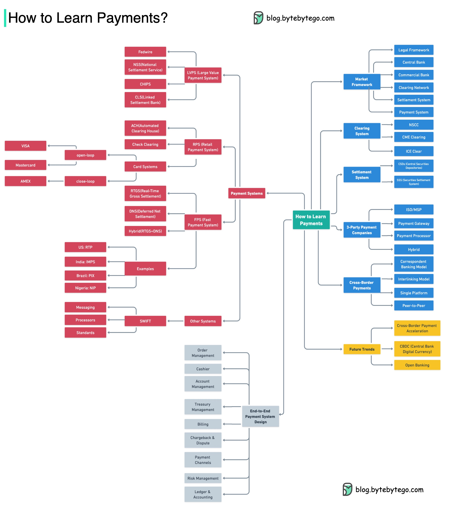
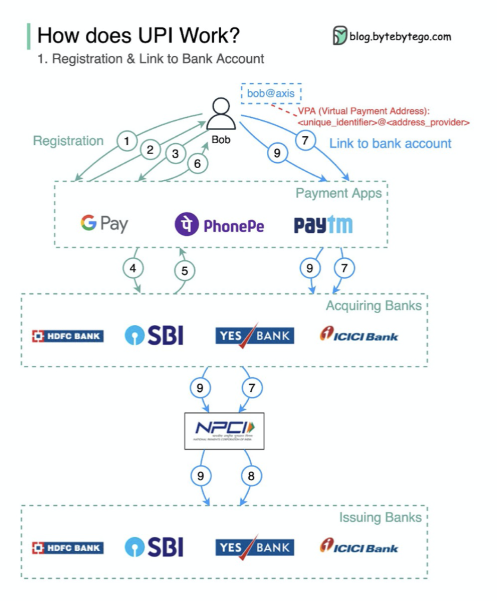

- [Payment systems](#payment-systems)
    - [How to learn payment systems?](#how-to-learn-payment-systems)
    - [Why is the credit card called “the most profitable product in banks”? How does VISA/Mastercard make money?](#why-is-the-credit-card-called-the-most-profitable-product-in-banks-how-does-visamastercard-make-money)
    - [How does VISA work when we swipe a credit card at a merchant’s shop?](#how-does-visa-work-when-we-swipe-a-credit-card-at-a-merchants-shop)
    - [Payment Systems Around The World Series (Part 1): Unified Payments Interface (UPI) in India](#payment-systems-around-the-world-series-part-1-unified-payments-interface-upi-in-india)

## Payment systems

### How to learn payment systems?

  

###  Why is the credit card called “the most profitable product in banks”? How does VISA/Mastercard make money?

The diagram below shows the economics of the credit card payment flow.

  

1.&nbsp;&nbsp;The cardholder pays a merchant $100 to buy a product.

2.&nbsp;The merchant benefits from the use of the credit card with higher sales volume and needs to compensate the issuer and the card network for providing the payment service. The acquiring bank sets a fee with the merchant, called the “merchant discount fee.”

3 - 4. The acquiring bank keeps $0.25 as the acquiring markup, and $1.75 is paid to the issuing bank as the interchange fee. The merchant discount fee should cover the interchange fee.

The interchange fee is set by the card network because it is less efficient for each issuing bank to negotiate fees with each merchant.

5.&nbsp;&nbsp;The card network sets up the network assessments and fees with each bank, which pays the card network for its services every month. For example, VISA charges a 0.11% assessment, plus a $0.0195 usage fee, for every swipe.

6.&nbsp;&nbsp;The cardholder pays the issuing bank for its services.

Why should the issuing bank be compensated?

- The issuer pays the merchant even if the cardholder fails to pay the issuer.
- The issuer pays the merchant before the cardholder pays the issuer.
- The issuer has other operating costs, including managing customer accounts, providing statements, fraud detection, risk management, clearing & settlement, etc.

### How does VISA work when we swipe a credit card at a merchant’s shop?

  

VISA, Mastercard, and American Express act as card networks for the clearing and settling of funds. The card acquiring bank and the card issuing bank can be – and often are – different. If banks were to settle transactions one by one without an intermediary, each bank would have to settle the transactions with all the other banks. This is quite inefficient.

The diagram below shows VISA’s role in the credit card payment process. There are two flows involved. Authorization flow happens when the customer swipes the credit card. Capture and settlement flow happens when the merchant wants to get the money at the end of the day.

- Authorization Flow

Step 0: The card issuing bank issues credit cards to its customers.

Step 1: The cardholder wants to buy a product and swipes the credit card at the Point of Sale (POS) terminal in the merchant’s shop.

Step 2: The POS terminal sends the transaction to the acquiring bank, which has provided the POS terminal.

Steps 3 and 4: The acquiring bank sends the transaction to the card network, also called the card scheme. The card network sends the transaction to the issuing bank for approval.

Steps 4.1, 4.2 and 4.3: The issuing bank freezes the money if the transaction is approved. The approval or rejection is sent back to the acquirer, as well as the POS terminal.

- Capture and Settlement Flow

Steps 1 and 2: The merchant wants to collect the money at the end of the day, so they hit ”capture” on the POS terminal. The transactions are sent to the acquirer in batch. The acquirer sends the batch file with transactions to the card network.

Step 3: The card network performs clearing for the transactions collected from different acquirers, and sends the clearing files to different issuing banks.

Step 4: The issuing banks confirm the correctness of the clearing files, and transfer money to the relevant acquiring banks.

Step 5: The acquiring bank then transfers money to the merchant’s bank.

Step 4: The card network clears up the transactions from different acquiring banks. Clearing is a process in which mutual offset transactions are netted, so the number of total transactions is reduced.

In the process, the card network takes on the burden of talking to each bank and receives service fees in return.

### Payment Systems Around The World Series (Part 1): Unified Payments Interface (UPI) in India

What’s UPI? UPI is an instant real-time payment system developed by the National Payments Corporation of India.

It accounts for 60% of digital retail transactions in India today.

UPI = payment markup language + standard for interoperable payments

  

