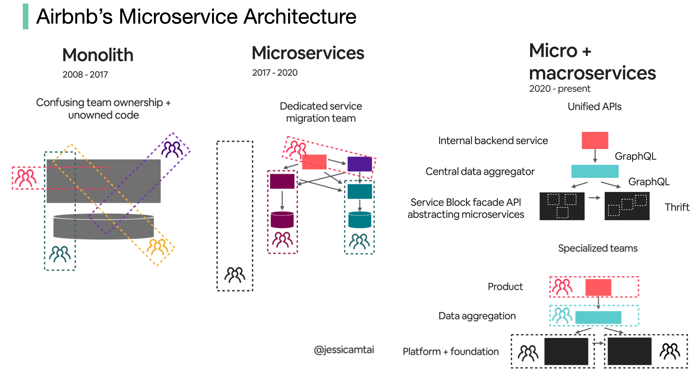
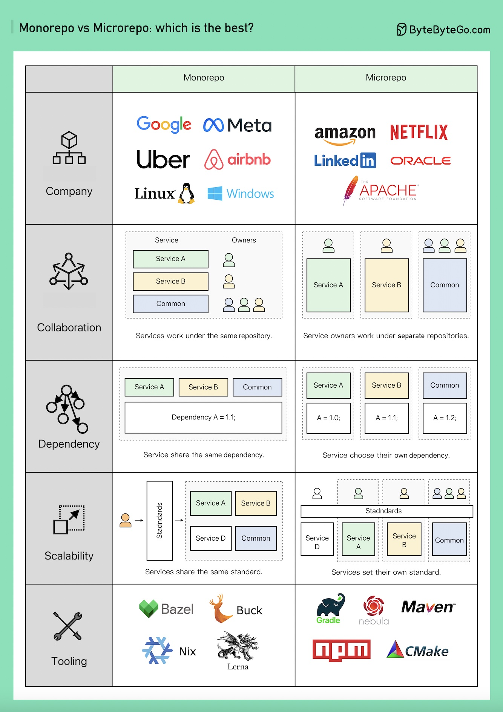
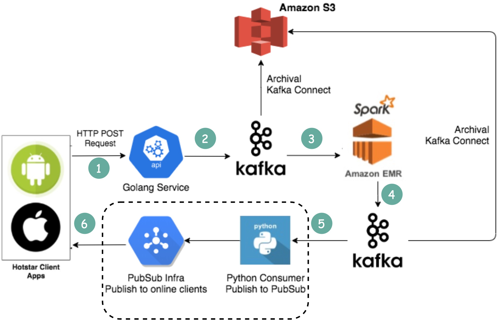

- [Real World Case Studies](#real-world-case-studies)
    - [Netflix's Tech Stack](#netflixs-tech-stack)
    - [Twitter Architecture 2022](#twitter-architecture-2022)
    - [Evolution of Airbnb’s microservice architecture over the past 15 years](#evolution-of-airbnbs-microservice-architecture-over-the-past-15-years)
    - [Monorepo vs. Microrepo.](#monorepo-vs-microrepo)
    - [How will you design the Stack Overflow website?](#how-will-you-design-the-stack-overflow-website)
    - [Why did Amazon Prime Video monitoring move from serverless to monolithic? How can it save 90% cost?](#why-did-amazon-prime-video-monitoring-move-from-serverless-to-monolithic-how-can-it-save-90-cost)
    - [How does Disney Hotstar capture 5 Billion Emojis during a tournament?](#how-does-disney-hotstar-capture-5-billion-emojis-during-a-tournament)
    - [How Discord Stores Trillions Of Messages](#how-discord-stores-trillions-of-messages)
    - [How do video live streamings work on YouTube, TikTok live, or Twitch?](#how-do-video-live-streamings-work-on-youtube-tiktok-live-or-twitch)

##  Real World Case Studies

### Netflix's Tech Stack

This post is based on research from many Netflix engineering blogs and open-source projects. If you come across any inaccuracies, please feel free to inform us.

  

**Mobile and web**: Netflix has adopted Swift and Kotlin to build native mobile apps. For its web application, it uses React.

**Frontend/server communication**: Netflix uses GraphQL.

**Backend services**: Netflix relies on ZUUL, Eureka, the Spring Boot framework, and other technologies.

**Databases**: Netflix utilizes EV cache, Cassandra, CockroachDB, and other databases.

**Messaging/streaming**: Netflix employs Apache Kafka and Fink for messaging and streaming purposes.

**Video storage**: Netflix uses S3 and Open Connect for video storage.

**Data processing**: Netflix utilizes Flink and Spark for data processing, which is then visualized using Tableau. Redshift is used for processing structured data warehouse information.

**CI/CD**: Netflix employs various tools such as JIRA, Confluence, PagerDuty, Jenkins, Gradle, Chaos Monkey, Spinnaker, Atlas, and more for CI/CD processes.

### Twitter Architecture 2022

Yes, this is the real Twitter architecture. It is posted by Elon Musk and redrawn by us for better readability.

  

### Evolution of Airbnb’s microservice architecture over the past 15 years

Airbnb’s microservice architecture went through 3 main stages.

  

Monolith (2008 - 2017)

Airbnb began as a simple marketplace for hosts and guests. This is built in a Ruby on Rails application - the monolith.

What’s the challenge?

- Confusing team ownership + unowned code
- Slow deployment

Microservices (2017 - 2020)

Microservice aims to solve those challenges. In the microservice architecture, key services include:

- Data fetching service
- Business logic data service
- Write workflow service
- UI aggregation service
- Each service had one owning team

What’s the challenge?

Hundreds of services and dependencies were difficult for humans to manage.

Micro + macroservices (2020 - present)

This is what Airbnb is working on now. The micro and macroservice hybrid model focuses on the unification of APIs.

### Monorepo vs. Microrepo.

Which is the best? Why do different companies choose different options?

  

Monorepo isn't new; Linux and Windows were both created using Monorepo. To improve scalability and build speed, Google developed its internal dedicated toolchain to scale it faster and strict coding quality standards to keep it consistent.

Amazon and Netflix are major ambassadors of the Microservice philosophy. This approach naturally separates the service code into separate repositories. It scales faster but can lead to governance pain points later on.

Within Monorepo, each service is a folder, and every folder has a BUILD config and OWNERS permission control. Every service member is responsible for their own folder.

On the other hand, in Microrepo, each service is responsible for its repository, with the build config and permissions typically set for the entire repository.

In Monorepo, dependencies are shared across the entire codebase regardless of your business, so when there's a version upgrade, every codebase upgrades their version.

In Microrepo, dependencies are controlled within each repository. Businesses choose when to upgrade their versions based on their own schedules.

Monorepo has a standard for check-ins. Google's code review process is famously known for setting a high bar, ensuring a coherent quality standard for Monorepo, regardless of the business.

Microrepo can either set its own standard or adopt a shared standard by incorporating the best practices. It can scale faster for business, but the code quality might be a bit different.
Google engineers built Bazel, and Meta built Buck. There are other open-source tools available, including Nix, Lerna, and others.

Over the years, Microrepo has had more supported tools, including Maven and Gradle for Java, NPM for NodeJS, and CMake for C/C++, among others.

### How will you design the Stack Overflow website?

If your answer is on-premise servers and monolith (on the bottom of the following image), you would likely fail the interview, but that's how it is built in reality!

  

**What people think it should look like**

The interviewer is probably expecting something like the top portion of the picture.

- Microservice is used to decompose the system into small components.
- Each service has its own database. Use cache heavily.
- The service is sharded.
- The services talk to each other asynchronously through message queues.
- The service is implemented using Event Sourcing with CQRS.
- Showing off knowledge in distributed systems such as eventual consistency, CAP theorem, etc.

**What it actually is**

Stack Overflow serves all the traffic with only 9 on-premise web servers, and it’s on monolith! It has its own servers and does not run on the cloud.

This is contrary to all our popular beliefs these days.

### Why did Amazon Prime Video monitoring move from serverless to monolithic? How can it save 90% cost?

The diagram below shows the architecture comparison before and after the migration.

  

What is Amazon Prime Video Monitoring Service?

Prime Video service needs to monitor the quality of thousands of live streams. The monitoring tool automatically analyzes the streams in real time and identifies quality issues like block corruption, video freeze, and sync problems. This is an important process for customer satisfaction.

There are 3 steps: media converter, defect detector, and real-time notification.

- What is the problem with the old architecture?

  The old architecture was based on Amazon Lambda, which was good for building services quickly. However, it was not cost-effective when running the architecture at a high scale. The two most expensive operations are:

1. The orchestration workflow - AWS step functions charge users by state transitions and the orchestration performs multiple state transitions every second.

2. Data passing between distributed components - the intermediate data is stored in Amazon S3 so that the next stage can download. The download can be costly when the volume is high.

- Monolithic architecture saves 90% cost

  A monolithic architecture is designed to address the cost issues. There are still 3 components, but the media converter and defect detector are deployed in the same process, saving the cost of passing data over the network. Surprisingly, this approach to deployment architecture change led to 90% cost savings!

This is an interesting and unique case study because microservices have become a go-to and fashionable choice in the tech industry. It's good to see that we are having more discussions about evolving the architecture and having more honest discussions about its pros and cons. Decomposing components into distributed microservices comes with a cost.

- What did Amazon leaders say about this?

  Amazon CTO Werner Vogels: “Building **evolvable software systems** is a strategy, not a religion. And revisiting your architecture with an open mind is a must.”

Ex Amazon VP Sustainability Adrian Cockcroft: “The Prime Video team had followed a path I call **Serverless First**…I don’t advocate **Serverless Only**”.

### How does Disney Hotstar capture 5 Billion Emojis during a tournament?

  

1. Clients send emojis through standard HTTP requests. You can think of Golang Service as a typical Web Server. Golang is chosen because it supports concurrency well. Threads in Golang are lightweight.

2. Since the write volume is very high, Kafka (message queue) is used as a buffer.

3. Emoji data are aggregated by a streaming processing service called Spark. It aggregates data every 2 seconds, which is configurable. There is a trade-off to be made based on the interval. A shorter interval means emojis are delivered to other clients faster but it also means more computing resources are needed.

4. Aggregated data is written to another Kafka.

5. The PubSub consumers pull aggregated emoji data from Kafka.

6. Emojis are delivered to other clients in real-time through the PubSub infrastructure. The PubSub infrastructure is interesting. Hotstar considered the following protocols: Socketio, NATS, MQTT, and gRPC, and settled with MQTT.

A similar design is adopted by LinkedIn which streams a million likes/sec.

### How Discord Stores Trillions Of Messages

The diagram below shows the evolution of message storage at Discord:

  

MongoDB ➡️ Cassandra ➡️ ScyllaDB

In 2015, the first version of Discord was built on top of a single MongoDB replica. Around Nov 2015, MongoDB stored 100 million messages and the RAM couldn’t hold the data and index any longer. The latency became unpredictable. Message storage needs to be moved to another database. Cassandra was chosen.

In 2017, Discord had 12 Cassandra nodes and stored billions of messages.

At the beginning of 2022, it had 177 nodes with trillions of messages. At this point, latency was unpredictable, and maintenance operations became too expensive to run.

There are several reasons for the issue:

- Cassandra uses the LSM tree for the internal data structure. The reads are more expensive than the writes. There can be many concurrent reads on a server with hundreds of users, resulting in hotspots.
- Maintaining clusters, such as compacting SSTables, impacts performance.
- Garbage collection pauses would cause significant latency spikes

ScyllaDB is Cassandra compatible database written in C++. Discord redesigned its architecture to have a monolithic API, a data service written in Rust, and ScyllaDB-based storage.

The p99 read latency in ScyllaDB is 15ms compared to 40-125ms in Cassandra. The p99 write latency is 5ms compared to 5-70ms in Cassandra.

### How do video live streamings work on YouTube, TikTok live, or Twitch?

Live streaming differs from regular streaming because the video content is sent via the internet in real-time, usually with a latency of just a few seconds.

The diagram below explains what happens behind the scenes to make this possible.

  

Step 1: The raw video data is captured by a microphone and camera. The data is sent to the server side.

Step 2: The video data is compressed and encoded. For example, the compressing algorithm separates the background and other video elements. After compression, the video is encoded to standards such as H.264. The size of the video data is much smaller after this step.

Step 3: The encoded data is divided into smaller segments, usually seconds in length, so it takes much less time to download or stream.

Step 4: The segmented data is sent to the streaming server. The streaming server needs to support different devices and network conditions. This is called ‘Adaptive Bitrate Streaming.’ This means we need to produce multiple files at different bitrates in steps 2 and 3.

Step 5: The live streaming data is pushed to edge servers supported by CDN (Content Delivery Network.) Millions of viewers can watch the video from an edge server nearby. CDN significantly lowers data transmission latency.

Step 6: The viewers’ devices decode and decompress the video data and play the video in a video player.

Steps 7 and 8: If the video needs to be stored for replay, the encoded data is sent to a storage server, and viewers can request a replay from it later.

Standard protocols for live streaming include:

- RTMP (Real-Time Messaging Protocol): This was originally developed by Macromedia to transmit data between a Flash player and a server. Now it is used for streaming video data over the internet. Note that video conferencing applications like Skype use RTC (Real-Time Communication) protocol for lower latency.
- HLS (HTTP Live Streaming): It requires the H.264 or H.265 encoding. Apple devices accept only HLS format.
- DASH (Dynamic Adaptive Streaming over HTTP): DASH does not support Apple devices.
- Both HLS and DASH support adaptive bitrate streaming.