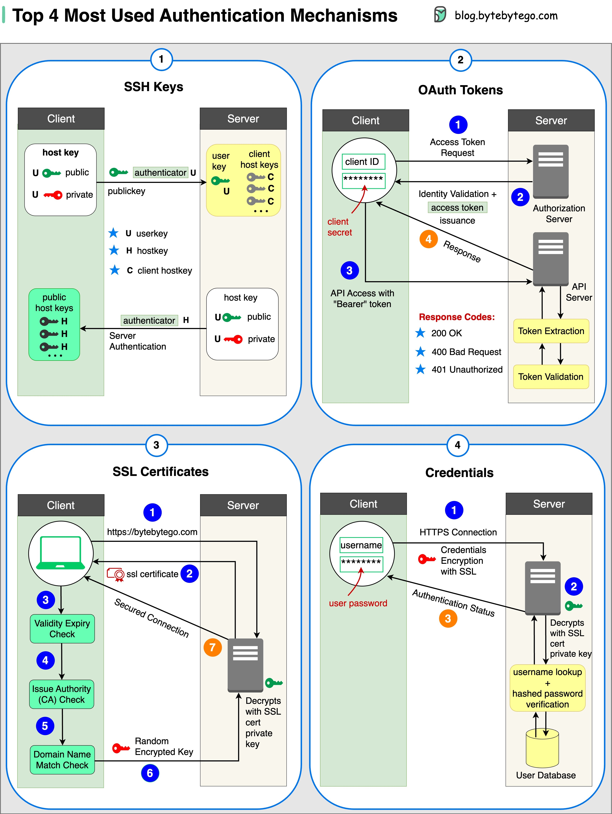

- [Security](#security)
    - [How does HTTPS work?](#how-does-https-work)
    - [Oauth 2.0 Explained With Simple Terms.](#oauth-20-explained-with-simple-terms)
    - [Top 4 Forms of Authentication Mechanisms](#top-4-forms-of-authentication-mechanisms)
    - [Session, cookie, JWT, token, SSO, and OAuth 2.0 - what are they?](#session-cookie-jwt-token-sso-and-oauth-20---what-are-they)
    - [How to store passwords safely in the database and how to validate a password?](#how-to-store-passwords-safely-in-the-database-and-how-to-validate-a-password)
    - [Explaining JSON Web Token (JWT) to a 10 year old Kid](#explaining-json-web-token-jwt-to-a-10-year-old-kid)
    - [How does Google Authenticator (or other types of 2-factor authenticators) work?](#how-does-google-authenticator-or-other-types-of-2-factor-authenticators-work)

## Security

### How does HTTPS work?

Hypertext Transfer Protocol Secure (HTTPS) is an extension of the Hypertext Transfer Protocol (HTTP.) HTTPS transmits encrypted data using Transport Layer Security (TLS.) If the data is hijacked online, all the hijacker gets is binary code.

  

How is the data encrypted and decrypted?

Step 1 - The client (browser) and the server establish a TCP connection.

Step 2 - The client sends a “client hello” to the server. The message contains a set of necessary encryption algorithms (cipher suites) and the latest TLS version it can support. The server responds with a “server hello” so the browser knows whether it can support the algorithms and TLS version.

The server then sends the SSL certificate to the client. The certificate contains the public key, host name, expiry dates, etc. The client validates the certificate.

Step 3 - After validating the SSL certificate, the client generates a session key and encrypts it using the public key. The server receives the encrypted session key and decrypts it with the private key.

Step 4 - Now that both the client and the server hold the same session key (symmetric encryption), the encrypted data is transmitted in a secure bi-directional channel.

Why does HTTPS switch to symmetric encryption during data transmission? There are two main reasons:

1. Security: The asymmetric encryption goes only one way. This means that if the server tries to send the encrypted data back to the client, anyone can decrypt the data using the public key.

2. Server resources: The asymmetric encryption adds quite a lot of mathematical overhead. It is not suitable for data transmissions in long sessions.

### Oauth 2.0 Explained With Simple Terms.

OAuth 2.0 is a powerful and secure framework that allows different applications to securely interact with each other on behalf of users without sharing sensitive credentials.

  

The entities involved in OAuth are the User, the Server, and the Identity Provider (IDP).

What Can an OAuth Token Do?

When you use OAuth, you get an OAuth token that represents your identity and permissions. This token can do a few important things:

Single Sign-On (SSO): With an OAuth token, you can log into multiple services or apps using just one login, making life easier and safer.

Authorization Across Systems: The OAuth token allows you to share your authorization or access rights across various systems, so you don't have to log in separately everywhere.

Accessing User Profile: Apps with an OAuth token can access certain parts of your user profile that you allow, but they won't see everything.

Remember, OAuth 2.0 is all about keeping you and your data safe while making your online experiences seamless and hassle-free across different applications and services.

### Top 4 Forms of Authentication Mechanisms

  

1. SSH Keys:

   Cryptographic keys are used to access remote systems and servers securely

1. OAuth Tokens:

   Tokens that provide limited access to user data on third-party applications

1. SSL Certificates:

   Digital certificates ensure secure and encrypted communication between servers and clients

1. Credentials:

   User authentication information is used to verify and grant access to various systems and services

### Session, cookie, JWT, token, SSO, and OAuth 2.0 - what are they?

These terms are all related to user identity management. When you log into a website, you declare who you are (identification). Your identity is verified (authentication), and you are granted the necessary permissions (authorization). Many solutions have been proposed in the past, and the list keeps growing.

  

From simple to complex, here is my understanding of user identity management:

- WWW-Authenticate is the most basic method. You are asked for the username and password by the browser. As a result of the inability to control the login life cycle, it is seldom used today.

- A finer control over the login life cycle is session-cookie. The server maintains session storage, and the browser keeps the ID of the session. A cookie usually only works with browsers and is not mobile app friendly.

- To address the compatibility issue, the token can be used. The client sends the token to the server, and the server validates the token. The downside is that the token needs to be encrypted and decrypted, which may be time-consuming.

- JWT is a standard way of representing tokens. This information can be verified and trusted because it is digitally signed. Since JWT contains the signature, there is no need to save session information on the server side.

- By using SSO (single sign-on), you can sign on only once and log in to multiple websites. It uses CAS (central authentication service) to maintain cross-site information.

- By using OAuth 2.0, you can authorize one website to access your information on another website.

### How to store passwords safely in the database and how to validate a password?

  

**Things NOT to do**

- Storing passwords in plain text is not a good idea because anyone with internal access can see them.

- Storing password hashes directly is not sufficient because it is pruned to precomputation attacks, such as rainbow tables.

- To mitigate precomputation attacks, we salt the passwords.

**What is salt?**

According to OWASP guidelines, “a salt is a unique, randomly generated string that is added to each password as part of the hashing process”.

**How to store a password and salt?**

1. the hash result is unique to each password.
1. The password can be stored in the database using the following format: hash(password + salt).

**How to validate a password?**

To validate a password, it can go through the following process:

1. A client enters the password.
1. The system fetches the corresponding salt from the database.
1. The system appends the salt to the password and hashes it. Let’s call the hashed value H1.
1. The system compares H1 and H2, where H2 is the hash stored in the database. If they are the same, the password is valid.

### Explaining JSON Web Token (JWT) to a 10 year old Kid

  

Imagine you have a special box called a JWT. Inside this box, there are three parts: a header, a payload, and a signature.

The header is like the label on the outside of the box. It tells us what type of box it is and how it's secured. It's usually written in a format called JSON, which is just a way to organize information using curly braces { } and colons : .

The payload is like the actual message or information you want to send. It could be your name, age, or any other data you want to share. It's also written in JSON format, so it's easy to understand and work with.
Now, the signature is what makes the JWT secure. It's like a special seal that only the sender knows how to create. The signature is created using a secret code, kind of like a password. This signature ensures that nobody can tamper with the contents of the JWT without the sender knowing about it.

When you want to send the JWT to a server, you put the header, payload, and signature inside the box. Then you send it over to the server. The server can easily read the header and payload to understand who you are and what you want to do.

### How does Google Authenticator (or other types of 2-factor authenticators) work?

Google Authenticator is commonly used for logging into our accounts when 2-factor authentication is enabled. How does it guarantee security?

Google Authenticator is a software-based authenticator that implements a two-step verification service. The diagram below provides detail.

  

There are two stages involved:

- Stage 1 - The user enables Google two-step verification.
- Stage 2 - The user uses the authenticator for logging in, etc.

Let’s look at these stages.

**Stage 1**

Steps 1 and 2: Bob opens the web page to enable two-step verification. The front end requests a secret key. The authentication service generates the secret key for Bob and stores it in the database.

Step 3: The authentication service returns a URI to the front end. The URI is composed of a key issuer, username, and secret key. The URI is displayed in the form of a QR code on the web page.

Step 4: Bob then uses Google Authenticator to scan the generated QR code. The secret key is stored in the authenticator.

**Stage 2**
Steps 1 and 2: Bob wants to log into a website with Google two-step verification. For this, he needs the password. Every 30 seconds, Google Authenticator generates a 6-digit password using TOTP (Time-based One Time Password) algorithm. Bob uses the password to enter the website.

Steps 3 and 4: The frontend sends the password Bob enters to the backend for authentication. The authentication service reads the secret key from the database and generates a 6-digit password using the same TOTP algorithm as the client.

Step 5: The authentication service compares the two passwords generated by the client and the server, and returns the comparison result to the frontend. Bob can proceed with the login process only if the two passwords match.

Is this authentication mechanism safe?

- Can the secret key be obtained by others?

  We need to make sure the secret key is transmitted using HTTPS. The authenticator client and the database store the secret key, and we need to make sure the secret keys are encrypted.

- Can the 6-digit password be guessed by hackers?

  No. The password has 6 digits, so the generated password has 1 million potential combinations. Plus, the password changes every 30 seconds. If hackers want to guess the password in 30 seconds, they need to enter 30,000 combinations per second.

